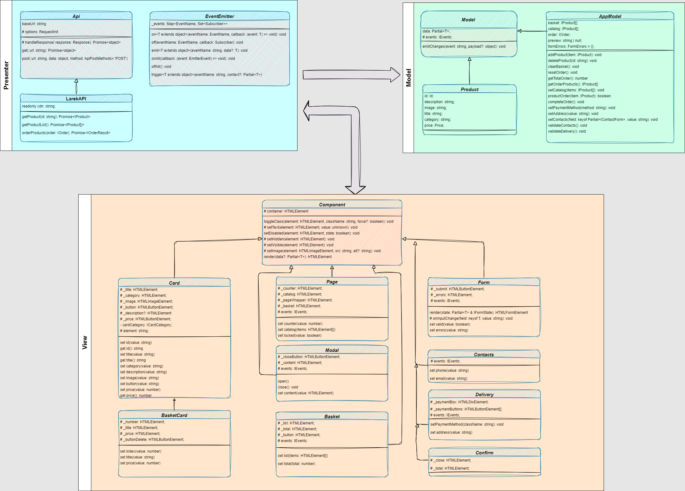

# Проектная работа "Веб-ларек"

Стек: HTML, SCSS, TS, Webpack

Структура проекта:
- src/ — исходные файлы проекта
- src/components/ — папка с JS компонентами
- src/components/base/ — папка с базовыми классами
- src/components/common/ — папка с основными классами

Важные файлы:
- src/pages/index.html — HTML-файл главной страницы
- src/types/index.ts — файл с типами
- src/index.ts — точка входа приложения
- src/scss/styles.scss — корневой файл стилей
- src/utils/constants.ts — файл с константами
- src/utils/utils.ts — файл с утилитами

## Установка и запуск
Для установки и запуска проекта необходимо выполнить команды

```
npm install
npm run start
```

или

```
yarn
yarn start
```
## Сборка

```
npm run build
```

или

```
yarn build
```

## Архитектура


В ходе разработки приложения "WEB-ларёк" был использован шаблон проектирования - MVP(Model-View-Presenter), который делит модули на три группы:
1. Model (классы Model, Product и AppModel)
2. View (классы Component, Card, Basket, Modal, Form, Page и Confirm)
3. Presenter (классы Api, LarekAPI, EventEmitter, исполняемый код в index.ts)

## Описание базовых классов, их методов и обрабатываемых событий

### Компоненты слоя Model:
1. Класс Model<T> - абстрактный класс для создания объекта хранения данных приложения.
Взаимодействует с EventEmitter через интерфейс IEvents.
Содержит в себе метод 'emitChanges', который служит для уведомления функций-'подписчиков' о том, что модель данных была изменена.

2. Класс Product - потомок класса Model. Предназначен для хранения данных о продуктах. Реализует интерфейс IProduct, не содержит методов.

3. Класс AppModel - потомок класса Model. Служит для хранения модели данных, а также реализует методы обработки данных. 
Реализуя интерфейсы IProduct, IOrder и тип FormErrors хранит в себе соответственно данные о каталоге продуктов, состоянии корзины и ошибках валидации форм.
Содержит методы:
  - 'addProduct' - добавляет товар в корзину;
  - 'deleteProduct' - удаляет товар из корзины;
  - 'resetOrder' - сбрасывает заказ в начальное состояние;
  - 'resetBasket' - очистить корзину;
  - 'getTotalOrder' - определить сумму заказа;
  - 'setCatalog' - сформировать массив объектов, содержащих данные карточек товара;
  - 'productOrdered' - проверить, содержится ли товар в корзине;
  - 'getOrderedProducts' - получить список товаров в корзине;
  - 'setOrder' - завершить заказ - перенести в заказ данные из корзины;
  - 'setPaymentMethod' - установить вид оплаты;
  - 'setAddress' - установить адрес;
  - 'validateDelivery' - валидировать доставку;
  - 'setContactsField' - установить поля контактов;
  - 'validateContacts' - валидировать поля контактов;

### Компоненты слоя View:
1. Класс Component<T> - базовый класс для создания элементов отвечающих за визуальное представления интерфейса приложения, в том числе контейнеров содержащих данные элементы.
Реализует методы отвечающие за управление свойствами DOM-элементов страницы:
  - 'toggleClass' - переключение класса;
  - 'setText' - установка текста для элемента;
  - 'setDisabled' - смена состояния атрибута disabled для элемента;
  - 'setHidden' - скрыть элемент;
  - 'setVisible' - показать элемент;
  - 'setImage' - установить изображение с альтернативным текстом;
  - 'render' - вернуть корневой DOM-элемент;

2. Page и Modal - потомки класса Component. 
  + Page является контейнером для галереи товаров и счетчика товаров в корзине.
    Содержит сеттеры:
    - 'set counter' - установка значения счетчика товаров в корзине;
    - 'set catalog' - заполнение контейнера элементами карточек массива товаров;
    - 'set locked' - установка состояния страницы на время открытия модального окна;

  + Modal - контейнер для форм ввода данных о доставке и контактах пользователя.
    Содержит сеттер:
    - 'set content' - заполнение модального окна элементами форм или уведомления об успешном завершении заказа;
    Методы:
    - 'open' - открытие модального окна, вызов события для блокирования прокрутки страницы;
    - 'close' - закрытие модального окна, вызов события для снятия блокирования прокрутки страницы;
    - 'render' - рендер модального окна на основе переданных данных.

3. Классы Card, Basket, Form, Delivery, Contacts и Confirm - потомки класса Component. Предназначены для визуализации компонент приложения, таких как: карточка товара, корзина, форма и подтверждения выполнения оплаты заказа.
  + Card - класс для визуального представления карточки товара.
    Содержит сеттеры для установки id, наименования, изображения, категории, описания и цены товара, установки кнопки добавления вкорзину. А также геттеры для получения id, наименования и цены товара.
  + Basket - класс представления для корзины товаров.
    Содержит следующие сеттеры для установки кол-ва товаров в корзине и заполнения корзины элементами карточек товара.
  + Form<T> - базовый класс для Delivery и Contacts. 
    Предназначен для визуализации элементов управления формами, а также отвечает за валидацию полей форм.
    Содержит методы 'onInputChange' вызывающий событие валидации поля формы, если содержимое поля изменилось.
    - 'render' - рендер формы на основании данных о валидации полей формы;
    - 'set valid' - установка состояния кнопки на основании данных валидации полей формы;
    - 'set errors' - установка текста для элемента отображающего ошибки валидации полей формы.
  + Delivery - класс визуализации формы ввода данных о доставке.
    Содержит метод: 'setClass' - упраление состоянием кнопок выбора способа платежа.
  + Contacts - класс визуализации формы ввода контактов пользователя.
  + Confirm - класс для вывода информации об успешном оформлении заказа.


### Компоненты слоя Presenter:
1. Класс Api - базовый класс осуществляющий обмен данными с сервером через запросы(GET, POST).  
Реализует методы:
  - 'get' - передача запроса методом GET;
  - 'post' - передача запроса методом POST;
  - 'handleResponse' - парсинг ответа сервера.

2. Класс LarekAPI - потомок класса Api, предназначен для обмена данными между сервером и моделью данных приложения.
Список методов:
  - 'getProduct' - запрос информации о продукте;
  - 'getProductList' - запрос информации о списке продуктов;
  - 'orderProducts' - отправка информации по заказу на сервер.

3. Класс EventEmitter - реализует брокер событий приложения. Устанавливает связь между событиями и подписчиками этих событий.
Содержит методы:
  - 'on' - установка обработчика на событие;
  - 'off' - снятие обработчика с события;
  - 'emit' - иницировать событие по запросу, опционально передать данные обработчику;
  - 'onAll' - подписка обработчика на все события;
  - 'offAll' - сброс всех событий;
  - 'trigger' - коллбек триггер, генерирующий событие при вызове.

В index.ts описаны основные события и их обработчики:
  - 'catalog:change' - отрисовка карточек товаров из каталога продуктов, установка слушателей в случае изменения модели данных каталога продуктов;
  - 'formDeliveryError:change' - валидация полей формы доставки заказа, вывод в форму сообщения об ошибке;
  - 'delivery:open' - открытие модального окна с формой доставки заказа;
  - 'payment:changed' - смена способа оплаты в модели данных;
  - 'order:submit' - отправка информации о заказе на сервер;
  - 'formContactsError:change' - валидация полей формы контактов заказчика, вывод в форму сообщения об ошибке;
  - 'address:change' - передача адреса доставки в модель данных;
  - 'contact:open' - открытие формы контактов;
  - 'contact:submit' - отправка формы заказа на сервер, открытие окна подтверждения заказа;
  - 'basket:open' - открыть корзину, вывести ее содержимое на экран;
  - 'basket:change' - изменить кол-во товара в корзине, стоимость заказа, отрисовать новые элементы корзины, установка слушателей на новые товары в корзине;
  - 'product:add' - добавление товара в корзину в модели данных;
  - 'preview:change' - заполнение превью данными товара после клика по карточке товара, установка слушателя события на добавление товара в корзину, рендер модального окна;
  - 'modal:open' - блокирование страницы, если открыто модальное окно;
  - 'modal:close' - разблокирование страницы, если модальное окно закрыто.

## Ключевые типы данных
```
// базовые простые типы
export type PaymentMethod = 'card' | 'cash'; // типизация способа оплаты литеральными типами

// базовый тип для товара
export interface IBaseProduct {
	description: string;
	image: string;
	title: string;
	category: string;
	price: number | null;
}

// типизация объекта с данными товара полученным от сервера
export type IProduct = IBaseProduct & {
	id: string;
}

// типизация карточки товара для рендера на странице c добавлением текста кнопки
export interface ICard = IBaseProduct & {
	button?: string;
  description?: string;
}

// типизация формы ввода контактов
export interface IContactForm {
	email: string;
	phone: string;
	address: string;
}

// 
export type IOrder = IContactForm & {
	items: Id[];
	total: number;
  payment: PaymentMethod;
};

// типизация ответа сервера после отправки заказа
export interface IOrderResult {
	id: string;
	total: number;
}

// типизация формы ввода формы оплаты и адреса
export interface IDeliveryForm {
	payment: PaymentMethod;
	address: string;
}

// типизация ошибок при заполнении форм
export type FormErrors = Partial<Record<keyof IOrder, string>>;

// типизация модели данных приложения
export interface IAppModel {
	catalog: IProduct[];
	basket: string[];
	preview: string | null;
	order: IOrder | null;
}

//типизация элементов интерфейса
// типизация корзины
interface IBasket {
	items: HTMLElement[];
	total: number;
}

// типизация форм
interface IFormState {
    valid: boolean;
    errors: string[];
}

// типизация элемента подтверждения
interface IConfirm {
    total: number;
}

// типизация главной страницы приложения
interface IPage {
	counter: number|null;
	catalog: HTMLElement[];
	locked: boolean;
}
```
Ссылка на репозиторий https://github.com/Andrey68Vyazovov/web-larek-frontend
